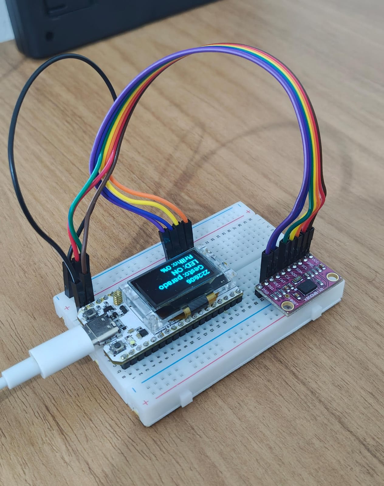
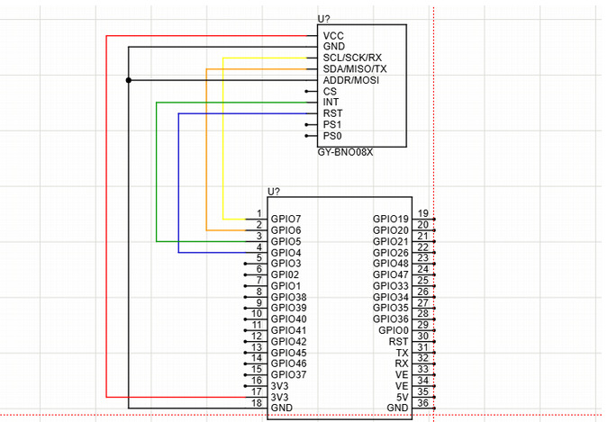
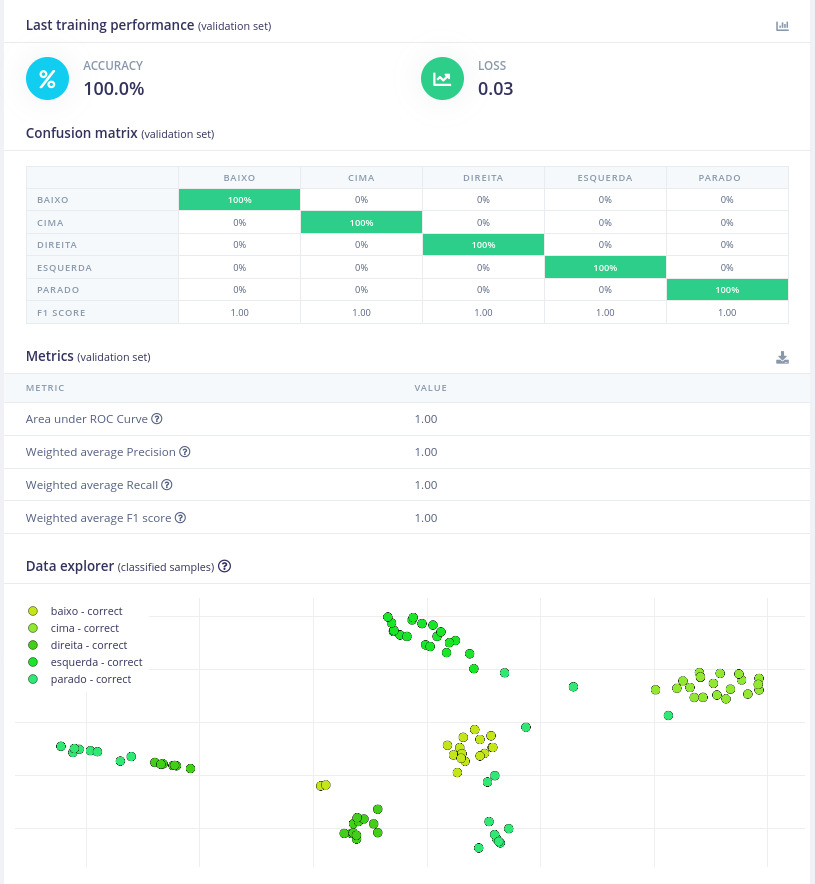
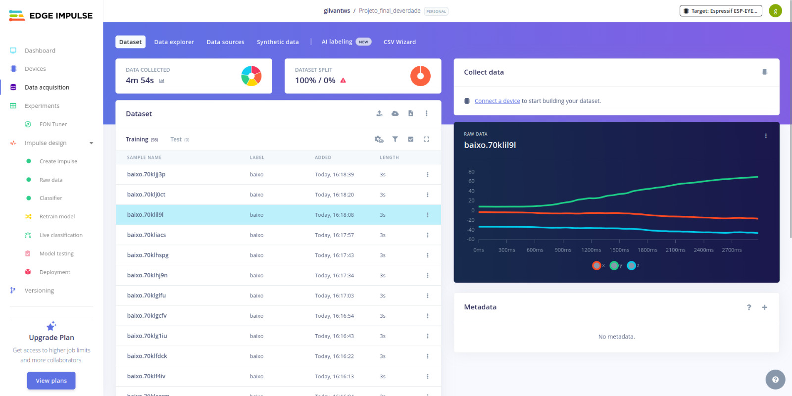
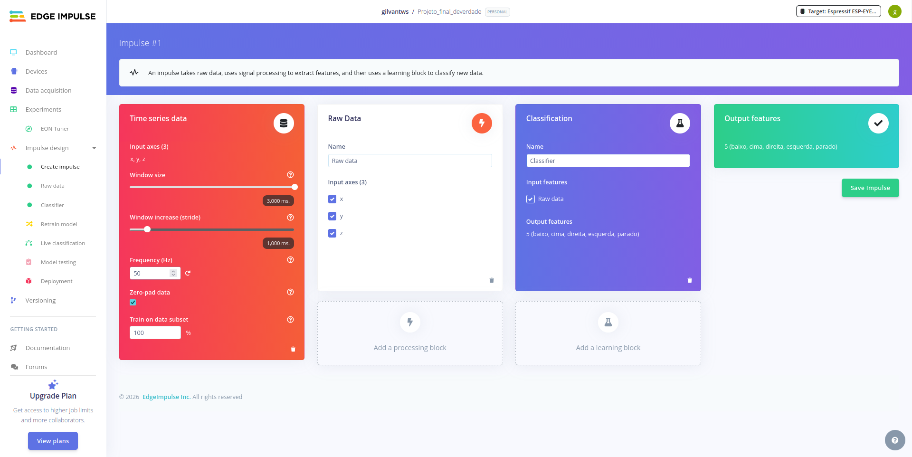
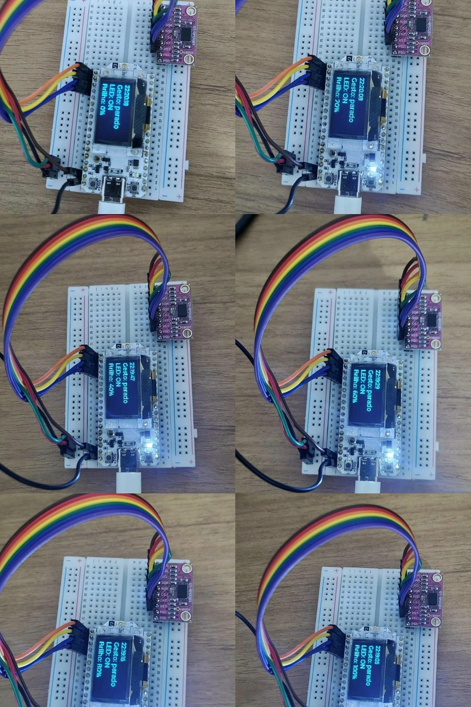
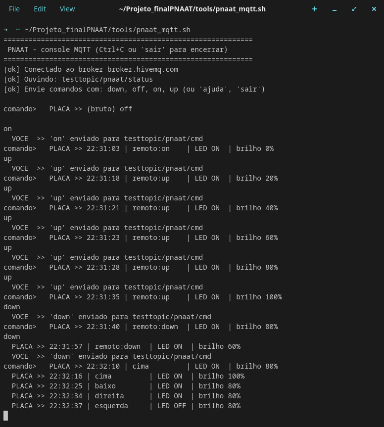

# PNAAT Gestures ESP32 — AI-Powered Home Automation 🤖


> A system that recognizes hand gestures using a neural network running 100% on an ESP32-S3, controlling an LED via PWM — with an NTP-synced clock, an OLED display, and MQTT-based telemetry and remote control.

> ⚠️ **This is a capstone/final course project (academic prototype).** It may contain inconsistencies, untreated edge cases, and limitations typical of a learning project — it is not a production-ready product.

## Table of Contents

- [Features](#features)
- [Hardware and Pinout](#hardware-and-pinout)
- [Software Architecture](#software-architecture)
- [Machine Learning Pipeline](#machine-learning-pipeline)
- [LED Control via PWM](#led-control-via-pwm)
- [OLED Display and NTP Clock](#oled-display-and-ntp-clock)
- [IoT Connectivity/MQTT](#iot-connectivitymqtt)
- [Built-in Diagnostics](#built-in-diagnostics)
- [How to Build and Flash](#how-to-build-and-flash)
- [Technical Challenges Solved](#technical-challenges-solved)
- [Repository Structure](#repository-structure)
- [Technologies Used](#technologies-used)
- [Credits and Acknowledgments](#credits-and-acknowledgments)
- [License](#license)

---

## Features

- Recognition of **5 gestures** by an embedded neural network: `right`, `left`, `up`, `down`, `idle`.
- `right` turns the LED on; `left` turns it off.
- `up`/`down` increase/decrease brightness in **20%** steps via PWM (LEDC, 5 kHz, 10-bit = 1024 levels).
- OLED SSD1306 128x64 display showing clock, detected gesture, LED state, and current brightness.
- Clock synced via **SNTP**, Brasília timezone (UTC-3).
- MQTT telemetry in JSON on every action.
- Remote LED control via MQTT (`on`/`off`/`up`/`down`).
- Resilient offline operation, with automatic Wi-Fi reconnection.
- Built-in terminal diagnostics (sample rate and INT pin pulse count).

---

## Hardware and Pinout

**Board:** Heltec WiFi LoRa 32 V3 (ESP32-S3)
**Sensors/peripherals:** BNO085 IMU (GY-BNO08X breakout), onboard OLED SSD1306 128x64 (I2C address `0x3C`), onboard red LED (`GPIO35`).

| Component | Signal | Pin | Notes |
|---|---|---|---|
| BNO085 | SDA | GPIO6 | `I2C_NUM_0`, 100 kHz |
| BNO085 | SCL | GPIO7 | `I2C_NUM_0`, 100 kHz |
| BNO085 | INT | GPIO5 | Required — signals new data |
| BNO085 | RST | GPIO4 | Fallback: software reset |
| BNO085 | ADD | GND | Sets address `0x4A` |
| BNO085 | VCC | 3.3V fixed | Never power from the Vext rail |
| OLED | SDA | GPIO17 | Dedicated `I2C_NUM_1` |
| OLED | SCL | GPIO18 | Dedicated `I2C_NUM_1` |
| OLED | RST | GPIO21 | — |
| OLED | Power | VEXT rail (GPIO36) | Active LOW, must be enabled before display init |
| Console | TX/RX | GPIO43/GPIO44 | UART |

> The project uses the **new I2C API** from ESP-IDF (`driver/i2c_master.h`), not the legacy API.





---

## Software Architecture

Framework: **ESP-IDF v5.4.4** (C/C++).

**Components (`components/`):**

| Component | Function |
|---|---|
| `i2c_config` | Initializes both I2C buses + the Vext rail |
| `oled_setup` | SSD1306 panel + LVGL via `esp_lvgl_port` |
| `bno085` | Vendored driver on top of the SH2 library (registry version had a `%u` bug breaking `-Werror`) |
| `edge_impulse` | Edge Impulse SDK + trained model (`model-parameters/`, `tflite-model/`) |

**Main modules (`main/`):**

| File | Function |
|---|---|
| `main.c` | Orchestrates boot |
| `imu_config.cpp` | Core: PWM, sample windowing, inference, gesture trigger logic, OLED, clock, diagnostics |
| `wifi_ntp.c` | Wi-Fi STA + SNTP |
| `mqtt_link.c` | MQTT client with a FreeRTOS queue |

**Boot order:** Wi-Fi (non-blocking) → Vext rail → OLED → IMU → wait for IP (up to 30s) → MQTT.

**Tasks:** `imu_service` (priority 5), sensor callback, `mqtt_pub`, `clock`, `diag`, `network`, internal LVGL task.

**Partitions (`partitions.csv`):** `nvs` 24K, `phy_init` 4K, `factory` 4 MB (binary ~1.1 MB).

---

## Machine Learning Pipeline

1. **Data collection:** a separate firmware (`receber_dados`) streams `roll,pitch,yaw` CSV at 50 Hz via the Edge Impulse Data Forwarder. The quaternion→Euler conversion formulas are identical in the collector and the final firmware.

```c
roll  = atan2f(2*(qr*qi + qj*qk), 1 - 2*(qi*qi + qj*qj)) * 57.2958f;
pitch = asinf(2*(qr*qj - qk*qi)) * 57.2958f;
yaw   = atan2f(2*(qr*qk + qi*qj), 1 - 2*(qj*qj + qk*qk)) * 57.2958f;
```

2. **Dataset:** 5 classes — `down`, `up`, `right`, `left`, `idle`.
3. **Model:** window of 150 samples × 3 axes = 450 values (~3s), int8-quantized network, compiled with the EON Compiler.
4. **Inference:** buffer filled by the sensor callback; once the window is full → `run_classifier()`. Configured via macros (`EI_CLASSIFIER_DSP_INPUT_FRAME_SIZE`, `EI_CLASSIFIER_LABEL_COUNT`).
5. **Anti-repeat trigger:** an action fires only when the winning label changes **and** confidence ≥ 60%. Detecting `idle` rearms the trigger.
   - `right → idle → idle`: LED stays on
   - `right → idle → right`: no new action







---

## Training Details (Edge Impulse)

This section documents the exact configuration used in Edge Impulse Studio to generate the embedded model, supporting experiment reproducibility.

### Impulse Configuration / Time Series Data

| Parameter | Value |
|---|---|
| Input axes | `x`, `y`, `z` (3 axes) |
| Window size | 3,000 ms |
| Window increase (stride) | 1,000 ms |
| Frequency | 50 Hz |
| Zero-pad data | Enabled |
| Train on data subset | 100% |
| Output classes | 5 (`down`, `up`, `right`, `left`, `idle`) |

### Signal Processing (DSP)

The project uses a **Raw Data** block with all three axes enabled and the **Scale axes** factor set to `1`, meaning no additional normalization is applied beyond the quaternion → Euler conversion.

| On-device performance metric | Value |
|---|---:|
| Processing time | 1 ms |
| Peak RAM usage | 2 KB |

### Neural Network Architecture

The model is a dense (fully connected) neural network, trained and quantized to **int8** by the EON Compiler.

| Layer | Detail |
|---|---|
| Input layer | 450 features (150 samples × 3 axes) |
| Dense layer | 20 neurons |
| Dense layer | 10 neurons |
| Output layer | 5 classes |

### Training Hyperparameters

| Parameter | Value |
|---|---|
| Number of training cycles | 30 |
| Learning rate | 0.0005 |
| Use learned optimizer | Disabled |
| Training processor | CPU |
| Model version | Quantized (`int8`) |

### Validation Results

| Metric | Value |
|---|---:|
| Accuracy | 100.0% |
| Loss | 0.03 |
| Area under ROC Curve | 1.00 |
| Weighted average Precision | 1.00 |
| Weighted average Recall | 1.00 |
| Weighted average F1 score | 1.00 |

The validation set produced an F1 score of **1.00 across all five classes**, with the following confusion matrix:

| Actual \\ Predicted | `down` | `up` | `right` | `left` | `idle` |
|---|---:|---:|---:|---:|---:|
| `down` | 100% | 0% | 0% | 0% | 0% |
| `up` | 0% | 100% | 0% | 0% | 0% |
| `right` | 0% | 0% | 100% | 0% | 0% |
| `left` | 0% | 0% | 0% | 100% | 0% |
| `idle` | 0% | 0% | 0% | 0% | 100% |

> ⚠️ **Validation note:** The 100% validation accuracy is a positive result, but it may also reflect a relatively small or non-diverse dataset. It is recommended to validate the model using data collected in different sessions and conditions to evaluate its generalization before treating it as final.

---

## LED Control via PWM

LEDC: channel 0, timer 0, low-speed mode, 5 kHz, 10-bit (duty 0-1023).

| Gesture | Action |
|---|---|
| `right` | LED ON |
| `left` | LED OFF |
| `up` | +20% brightness |
| `down` | -20% brightness |

```c
duty = (brightness_percent * 1023) / 100;  // OFF = duty 0
```



---

## OLED Display and NTP Clock

4 lines: `HH:MM:SS` clock, `Gesture:`, `LED ON/OFF`, `Brightness X%`. Updates on every classified window or remote command (shows the source, e.g. `remote:on`). Before syncing, shows `--:--:--`.

With no battery-backed RTC, the board always boots into the Unix epoch. Once connected to Wi-Fi, SNTP syncs with `pool.ntp.org` and `a.st1.ntp.br`, timezone `<-03>3` (Brasília, no daylight saving).

---

## IoT Connectivity/MQTT

**Broker:** `broker.hivemq.com:1883`

**Publish** — `testtopic/pnaat/status` (QoS 1), on connect, on every gesture, and on every remote command:

```json
{
  "source": "up",
  "led": true,
  "brightness": 80,
  "time": "21:03:12"
}
```

**Subscribe** — `testtopic/pnaat/cmd`, payloads: `on`, `off`, `up`, `down`.

**Hybrid semantics:** last write wins — a remote command applies immediately, but local gestures keep working afterward.

**Resilience:** publishing goes through a FreeRTOS queue outside the sensor's critical path; without Wi-Fi/internet everything keeps working locally, with automatic reconnection. Credentials configurable via `menuconfig` (section "Configuracao Wi-Fi / MQTT (PNAAT)").




---

## Built-in Diagnostics

The `diag` task prints every 5s:

[diag] X samples/s | Y INT pulses/s | windows: Z


Expected: ~50 samples/s and ~100 pulses/s.

| Samples | INT Pulses | Diagnosis |
|---|---|---|
| 0 | 0 | Wiring issue on INT |
| 0 | OK | Software issue |
| OK | OK | System healthy |

---

## How to Build and Flash

```bash
source ~/esp/v5.4.4/esp-idf/export.sh
idf.py menuconfig      # fill in SSID/password in the PNAAT section
idf.py -p ttyUSB0 build flash monitor
```

Optional MQTT console in `tools/`:

```bash
./tools/pnaat_mqtt.sh
```

Interactive terminal showing formatted telemetry (`time | source | LED | brightness`) and sending commands.

**Relevant `sdkconfig` settings:** `-Os` optimization, `CONFIG_PARTITION_TABLE_CUSTOM`, 8 MB flash, `LV_FONT_MONTSERRAT_12` enabled.

---

## Technical Challenges Solved

1. Link error: `imu_config_init()` declared/called but never defined.
2. Migration from the legacy I2C API to `driver/i2c_master.h`.
3. Bug in the `rinku404/bno085` registry component (`%u` broke `-Werror`) — fixed by vendoring it.
4. Conflict between a custom flush callback and `esp_lvgl_port`'s internal callback.
5. Default 1 MB app partition overflow — fixed with a custom 4 MB partition table and correcting the flash size in `sdkconfig` (2 MB configured vs. 8 MB actual).
6. Bloated binary from `-Og` — switched to `-Os`, suppressing false `-Wuninitialized` positives from the Edge Impulse SDK headers.
7. MQTT race condition (DNS error `getaddrinfo 202`) — fixed by starting MQTT only after `GOT_IP`.
8. Intermittent IMU failures — root cause: a loose jumper on the INT pin, found via diagnostics.
9. GCC 14 deprecations (`volatile` increment, `std::is_pod`).

---

## Repository Structure
```
Projeto_finalPNAAT/
├── build/
├── components/
│   ├── i2c_config/
│   ├── oled_setup/
│   └── bno085/              # vendored
├── docs/
│   ├── images/
│   │   ├── 1.jpeg
│   │   ├── 2.jpeg
│   │   ├── 3.jpeg
│   │   ├── 4.jpeg
│   │   ├── 5.jpeg
│   │   ├── 6.jpeg
│   │   ├── 7.jpeg
│   │   └── 8.png
│   └── Report/
│       ├── Report.pdf
│       └── Relatorio.pdf
├── main/
│   ├── main.c
│   ├── imu_config.cpp
│   ├── imu_config.h
│   ├── wifi_ntp.c
│   ├── wifi_ntp.h
│   ├── mqtt_link.c
│   ├── mqtt_link.h
│   ├── Kconfig.projbuild
│   └── idf_component.yml
├── managed_components/
├── tools/
│   ├── pnaat_mqtt.sh
│   └── pnaat_mqtt.py
├── CMakeLists.txt
├── LICENSE
├── README.md
├── dependencies.lock
├── partitions.csv
├── sdkconfig
└── sdkconfig.old
```
---

## Documentation

The `docs/` directory contains the project's supporting documentation and images:

- `docs/images/` contains the images used throughout the README and project documentation.
  - Images `1.jpeg` through `7.jpeg` are JPEG files.
  - Image `8.png` is a PNG file and contains the Edge Impulse Studio screenshots for the data explorer, accuracy/loss results, and confusion matrix.
- `docs/Report/` contains two versions of the project report:
  - `Report.pdf` — report in **English**.
  - `Relatorio.pdf` — report in **Portuguese**.

The report documents the complete project, including the hardware and software architecture, machine-learning pipeline, Edge Impulse training configuration and validation results, PWM LED control, OLED/NTP clock, MQTT connectivity, diagnostics, build instructions, technical challenges, and repository structure.

---

## Technologies Used

ESP-IDF v5.4.4 · FreeRTOS · Edge Impulse + TensorFlow Lite Micro (EON) · LVGL 9.2 · esp_lvgl_port · MQTT (esp-mqtt) · SNTP/LwIP · LEDC driver · New `i2c_master` API

---

## Credits and Acknowledgments

PNAAT course · Edge Impulse platform · Heltec · Espressif community

---

## License

This project is licensed under the MIT License — see the [LICENSE](LICENSE) file for details.

---

> **100% edge AI** — classification happens on the microcontroller, with no cloud dependency.
